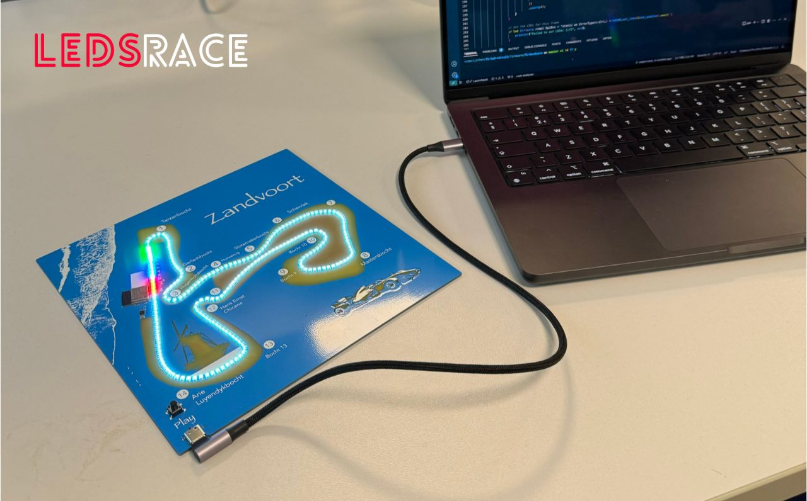
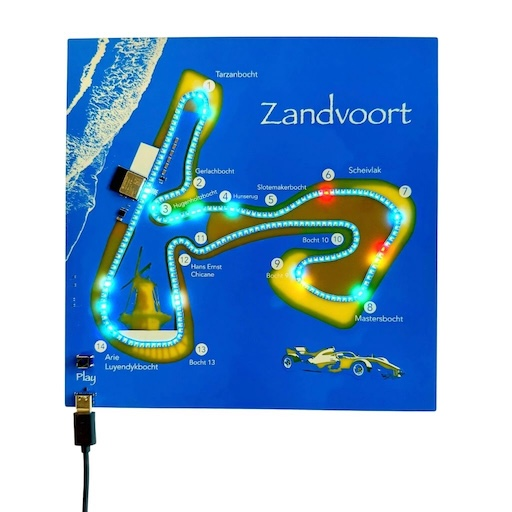
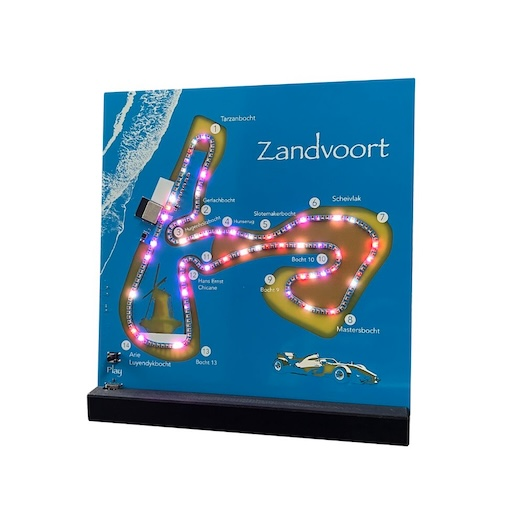

# LEDSRACE firmware

This is the firmware repository for the LEDSRACE circuit projects. LEDSRACE is based on the ESP32-C3-mini. Official firmware is written in Rust and makes use of the [Embassy ecosystem](https://embassy.dev).

## Crates

The project is organized in two separate crates:

Crate | Description
--- | ---
[ledsrace](/ledsrace-application/) | Application crate that compiles to a binary to run on the hardware
[ledsrace-core](/ledsrace-core/) | Hardware independent core crate. For logic and shared functionality and tests.

The `ledsrace` crate depends on `ledsrace-core` and has the actual programs that can be run on the LEDSRACE board.

## What can it do?

### Play back the F1 Grand Prix

We can play the 2023 and 2024 Formula 1

### Run other animations

We provide a set of other animations you can run on the board.

### Program it yourself.

You can use this repository as a starting point, or write it yourself from scratch in Rust or C.

## Functionality

- 216 Smart LEDS HD108-2020.
- 1x temperature sensor for safety
- Wifi (currently not implemented in firmware)
- USB Connection (currently not implemented in firmware)

## License

LEDSRACE firmware is licensed under the MIT license ([LICENSE](LICENSE) or http://opensource.org/licenses/MIT).

## Disclaimer

LEDSRACE is an unofficial project and is not associated in any way with the Formula 1 companies. F1, FORMULA ONE, FORMULA 1, FIA FORMULA ONE WORLD CHAMPIONSHIP, GRAND PRIX and related marks are trade marks of Formula One Licensing B.V.
