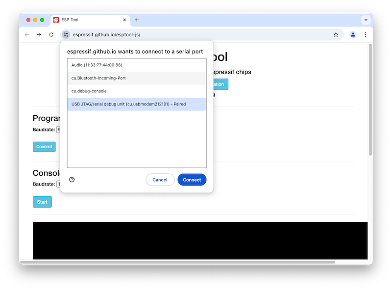
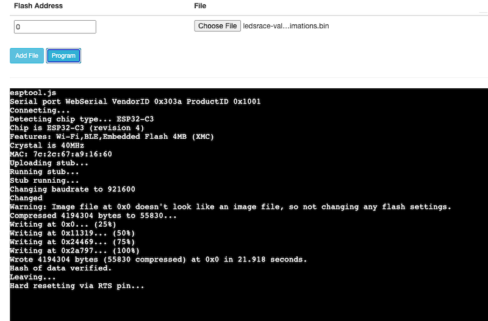

# Flashing ESP32 via Web Browser


This method allows you to update the firmware/program of the LEDSRACE board without having to install any special developer tools. This method makes use of `Web Serial API` which has best support in Google Chrome.

## Requirements

* Computer or laptop
* Google Chrome or Microsoft Edge
* USB cable

## Steps

1. Connect LEDSRACE board using USB to your computer.
2. Using Google Chrome, Go to https://espressif.github.io/esptool-js/
3. Click on Connect and select the `USB JTAG/serial debug unit` device.
    
4. Enter Flash address `0`
5. Select the firmware file (e.g. `firmware.bin`).
6. Click `Program`
7. When it is finished it should show something like this
    ```
    Wrote 4194304 bytes (55830 compressed) at 0x0 in 21.918 seconds.
    Hash of data verified.
    Leaving...
    Hard resetting via RTS pin...
    ```
    
8. Disconnect USB and reconnect again to reboot.
9. It should now run the new program.